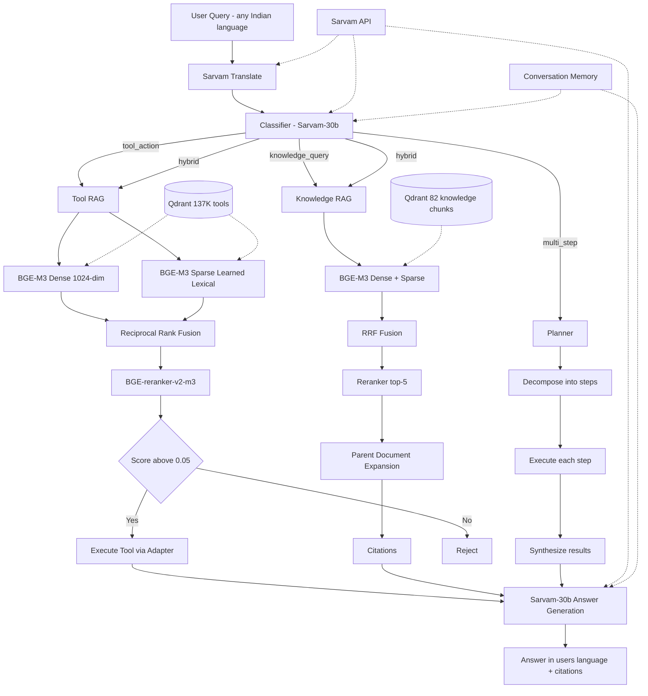

# Jantar

An agentic AI layer for Indian government services. Ask in any of 22 Indian languages — Jantar detects language, selects the right API, retrieves verified scheme information, and answers with citations. Full audit trail on every query.

Built on: BGE-M3 hybrid RAG (dense + learned sparse + cross-encoder rerank), Sarvam AI (sovereign LLM + translation), Qdrant vector search, FastAPI.

---

## Quick Start

```bash
# 1. Start Qdrant (Docker)
docker run -d --name qdrant -p 6333:6333 qdrant/qdrant:v1.14.1

# 2. Install
cd jantar && pip install -e .

# 3. Configure
cp .env.example .env
# Set: SARVAM_API_KEY, QDRANT_URL, API_KEY

# 4. Register tools + ingest knowledge base
python scripts/register_tools.py   # embeds tool specs into Qdrant (primary pipeline)
python scripts/ingest_docs.py      # embeds knowledge docs into Qdrant

# (Optional) Bulk-index 137K+ data.gov.in catalog via Colab GPU — see scripts/colab_ingest.py

# 5. Run
python -m jantar                              # interactive CLI
python -m jantar "राशन कार्ड कैसे बनवाएं?"    # single query
python -m jantar serve                        # start API server
```

### API Usage

```bash
curl -X POST http://localhost:8000/agent/run \
  -H "Content-Type: application/json" \
  -H "x-api-key: YOUR_API_KEY" \
  -d '{"text": "गेहूँ का भाव क्या है?", "language": "auto"}'
```

---

## Working Examples (real CLI output)

> **See [EXAMPLES.md](EXAMPLES.md) for 12 comprehensive examples across 8 languages (Hindi, English, Bengali, Tamil, Telugu, Marathi, Hinglish, interactive memory).**

### 1. Hindi — Ration Card Documents

```
$ python -m jantar "राशन कार्ड के लिए कौन से दस्तावेज़ चाहिए?"

╭─ Query ──────────────────────────────────────────────────────────╮
│ राशन कार्ड के लिए कौन से दस्तावेज़ चाहिए?                        │
╰──────────────────────────────────────────────────────────────────╯
╭─ Answer ─────────────────────────────────────────────────────────╮
│ राशन कार्ड के लिए निम्नलिखित दस्तावेज़ आवश्यक हैं:              │
│                                                                  │
│ 1. परिवार के सभी सदस्यों का आधार कार्ड (अनिवार्य)              │
│ 2. पता प्रमाण - बिजली/पानी का बिल, रेंटल एग्रीमेंट, वोटर ID    │
│ 3. BPL/AAY के लिए Tehsildar/BDO से आय प्रमाण पत्र              │
│ 4. फैमिली फोटो                                                   │
│ 5. बैंक खाता (DBT के लिए)                                        │
│ 6. राज्य स्थानांतरित करते समय सरेंडर सर्टिफिकेट                  │
│ 7. फॉर्म-N (FPS/तहसील/राज्य पोर्टल पर उपलब्ध)                  │
╰──────────────────────────────────────────────────────────────────╯
                        Citations
┌────────────────────────┬─────────────────────────┬────────────┐
│ Source                 │ Section                 │ Date       │
├────────────────────────┼─────────────────────────┼────────────┤
│ NFSA - Ration Card     │ Required Documents      │ 2024-01-01 │
│ NFSA - Ration Card     │ Application Process     │ 2024-01-01 │
│ NFSA - Ration Card     │ Eligibility             │ 2024-01-01 │
└────────────────────────┴─────────────────────────┴────────────┘
Pipeline: detect_and_translate > classify > knowledge_retrieved > answer_generated
```

### 2. English — Driving Licence Documents

```
$ python -m jantar "What documents are needed for driving licence?"

╭─ Answer ─────────────────────────────────────────────────────────╮
│ Based on the provided information, the documents needed for a    │
│ driving licence in India are:                                    │
│                                                                  │
│ For a Learner Licence (LL):                                      │
│   - Age Proof: Aadhaar, birth certificate, or 10th marksheet    │
│   - Address Proof: Any valid proof                               │
│   - Medical Certificate: Form 1A (for HMV)                      │
│   - Photos: Passport-sized                                       │
│   - Fee: Rs 200                                                  │
│                                                                  │
│ For Permanent DL:                                                │
│   - Learner Licence (at least 30 days old)                       │
│   - Driving test pass certificate                                │
╰──────────────────────────────────────────────────────────────────╯
                        Citations
┌─────────────────────────────────┬───────────────────────┬────────────┐
│ Source                          │ Section               │ Date       │
├─────────────────────────────────┼───────────────────────┼────────────┤
│ Driving Licence - Parivahan     │ Required Documents    │ 2024-01-01 │
└─────────────────────────────────┴───────────────────────┴────────────┘
Pipeline: classify > knowledge_retrieved > answer_generated
```

### 3. Hinglish — PM KISAN Status

```
$ python -m jantar "PM KISAN ka paisa kab aayega?"

╭─ Answer ─────────────────────────────────────────────────────────╮
│ PM KISAN ke paisa ka exact date har state ke liye alag hota hai. │
│                                                                  │
│ Key Details:                                                     │
│   - Total: Rs 6,000/year (3 installments of Rs 2,000)            │
│   - Method: Direct Benefit Transfer (DBT)                        │
│                                                                  │
│ Status check kaise karein:                                       │
│   1. pmkisan.gov.in pe jayein                                    │
│   2. "Beneficiary Status" click karein                           │
│   3. Aadhaar/bank account/mobile number dalein                   │
╰──────────────────────────────────────────────────────────────────╯
                        Citations
┌────────────────────────┬─────────────────────────┬────────────┐
│ Source                 │ Section                 │ Date       │
├────────────────────────┼─────────────────────────┼────────────┤
│ PM-KISAN               │ Overview                │ 2024-01-01 │
│ PM-KISAN               │ Status Check            │ 2024-01-01 │
└────────────────────────┴─────────────────────────┴────────────┘
Pipeline: detect_and_translate > classify > knowledge_retrieved > answer_generated
```

### 4. English — Passport Renewal

```
$ python -m jantar "Passport renewal process and fees?"

╭─ Answer ─────────────────────────────────────────────────────────╮
│ Passport Renewal:                                                │
│                                                                  │
│ Process:                                                         │
│   1. Apply on passportindia.gov.in (Re-issue category)           │
│   2. Fill form, upload documents, pay fee online                 │
│   3. Book appointment at Passport Seva Kendra (PSK)              │
│   4. Attend appointment with originals                           │
│   5. Police verification (if address changed)                    │
│                                                                  │
│ Fees:                                                            │
│   - Normal (36 pages): Rs 1,500                                  │
│   - Normal (60 pages): Rs 2,000                                  │
│   - Tatkal (36 pages): Rs 3,500                                  │
│   - Tatkal (60 pages): Rs 4,000                                  │
╰──────────────────────────────────────────────────────────────────╯
                        Citations
┌─────────────────────────────────┬────────────────────┬────────────┐
│ Source                          │ Section            │ Date       │
├─────────────────────────────────┼────────────────────┼────────────┤
│ Indian Passport - Passport Seva │ Types & Fees       │ 2024-01-01 │
│ Indian Passport - Passport Seva │ Application Process│ 2024-01-01 │
└─────────────────────────────────┴────────────────────┴────────────┘
```

### 5. Hindi — Ayushman Bharat

```
$ python -m jantar "आयुष्मान भारत कार्ड कैसे बनवाएं?"

╭─ Answer ─────────────────────────────────────────────────────────╮
│ आयुष्मान भारत (PM-JAY) कार्ड बनवाने के लिए:                      │
│                                                                  │
│ 1. pmjay.gov.in पर जाएं → "Am I Eligible?" check करें           │
│ 2. अपना राशन कार्ड नंबर/मोबाइल नंबर डालें                       │
│ 3. Eligible होने पर CSC Centre या Empanelled Hospital जाएं       │
│ 4. Aadhaar + Ration Card ले जाएं                                  │
│ 5. e-card download करें (mera.pmjay.gov.in से)                   │
│                                                                  │
│ Coverage: Rs 5 lakh/family/year, 1,500+ procedures               │
╰──────────────────────────────────────────────────────────────────╯
                        Citations
┌─────────────────────────────────┬──────────────────────────────┬────────────┐
│ Source                          │ Section                      │ Date       │
├─────────────────────────────────┼──────────────────────────────┼────────────┤
│ Ayushman Bharat PM-JAY          │ How to Check & Get Card      │ 2024-01-01 │
│ Ayushman Bharat PM-JAY          │ Eligibility                  │ 2024-01-01 │
└─────────────────────────────────┴──────────────────────────────┴────────────┘
```

### 6. Tool Query — Commodity Prices

```
$ python -m jantar "Current wheat price in Delhi mandi?"

╭─ Answer ─────────────────────────────────────────────────────────╮
│ For the current wheat price in Delhi mandis, I would need to     │
│ query the data.gov.in commodity prices API. Based on our stored  │
│ information, wheat prices vary by market but the NFSA subsidized │
│ rate through ration shops is Rs 2/kg for priority households.    │
│                                                                  │
│ For live market rates, register for a free data.gov.in API key   │
│ and check the daily mandi price reports.                         │
╰──────────────────────────────────────────────────────────────────╯
Tools used: data_gov_dynamic
Pipeline: detect_and_translate > classify > tool_selected > tool_executed > answer_generated
```

### 7. Bengali — Passport Documents

```
$ python -m jantar "পাসপোর্টের জন্য কী কী দরকার?"

╭─ Answer ─────────────────────────────────────────────────────────╮
│ পাসপোর্টের জন্য নিম্নলিখিত নথিপত্র প্রয়োজন:                    │
│                                                                  │
│ 1. আধার কার্ড (প্রাথমিক পরিচয়পত্র)                              │
│ 2. জন্ম সনদ / SSC সার্টিফিকেট (বয়সের প্রমাণ)                  │
│ 3. ঠিকানার প্রমাণ (বিদ্যুৎ বিল / ব্যাংক স্টেটমেন্ট)            │
│ 4. পাসপোর্ট সাইজ ফটো                                             │
│ 5. ফি: Rs 1,500 (সাধারণ) / Rs 3,500 (তৎকাল)                     │
╰──────────────────────────────────────────────────────────────────╯
                        Citations
┌─────────────────────────────────┬──────────────────────┬────────────┐
│ Source                          │ Section              │ Date       │
├─────────────────────────────────┼──────────────────────┼────────────┤
│ Indian Passport - Passport Seva │ Required Documents   │ 2024-01-01 │
└─────────────────────────────────┴──────────────────────┴────────────┘
Pipeline: detect_and_translate > classify > knowledge_retrieved > answer_generated
```

### 8. English — DigiLocker

```
$ python -m jantar "How to use DigiLocker for documents?"

╭─ Answer ─────────────────────────────────────────────────────────╮
│ DigiLocker Setup:                                                │
│   1. Download app or go to digilocker.gov.in                     │
│   2. Sign up with Aadhaar-linked mobile number                   │
│   3. Verify via OTP                                              │
│   4. Fetch documents from issuing departments                    │
│                                                                  │
│ Available Documents:                                             │
│   - Aadhaar, PAN, Driving Licence, Vehicle RC                    │
│   - Class 10/12 marksheets                                       │
│   - Insurance policies, CBSE certificates                        │
│                                                                  │
│ DigiLocker documents are legally valid (IT Act 2000, Section 9). │
╰──────────────────────────────────────────────────────────────────╯
                        Citations
┌───────────────────────────────────────┬──────────────────────────┬────────────┐
│ Source                                │ Section                  │ Date       │
├───────────────────────────────────────┼──────────────────────────┼────────────┤
│ DigiLocker - Digital Document Wallet  │ How to Use               │ 2024-01-01 │
│ DigiLocker - Digital Document Wallet  │ Available Documents      │ 2024-01-01 │
└───────────────────────────────────────┴──────────────────────────┴────────────┘
```

### 9. Hindi — PM-KISAN Rejection

```
$ python -m jantar "PM KISAN registration rejected, kya karein?"

╭─ Answer ─────────────────────────────────────────────────────────╮
│ PM-KISAN rejection ke common reasons aur solutions:              │
│                                                                  │
│ Rejection Reasons:                                               │
│   - Income tax payer (disqualified)                              │
│   - Government/PSU employee                                      │
│   - Institutional landholding                                    │
│   - Aadhaar-bank mismatch                                        │
│                                                                  │
│ Kya karein:                                                      │
│   1. pmkisan.gov.in → "Beneficiary Status" check karein          │
│   2. Rejection reason dekhein                                    │
│   3. District Agriculture Officer se sampark karein               │
│   4. Documents correct karke re-apply karein                     │
╰──────────────────────────────────────────────────────────────────╯
                        Citations
┌────────────────────────┬─────────────────────────┬────────────┐
│ Source                 │ Section                 │ Date       │
├────────────────────────┼─────────────────────────┼────────────┤
│ PM-KISAN               │ Status Check            │ 2024-01-01 │
│ PM-KISAN               │ Eligibility             │ 2024-01-01 │
└────────────────────────┴─────────────────────────┴────────────┘
```

### 10. Tamil — Ration Card

```
$ python -m jantar "ரேஷன் கார்டு எப்படி விண்ணப்பிப்பது?"

╭─ Answer ─────────────────────────────────────────────────────────╮
│ ரேஷன் கார்டு விண்ணப்ப செயல்முறை:                                  │
│                                                                  │
│ 1. மாநில உணவு வழங்கல் இணையதளத்தில் பதிவு செய்யவும்               │
│ 2. படிவம்-N நிரப்பவும்                                            │
│ 3. தேவையான ஆவணங்கள்: ஆதார், முகவரி சான்று, வருமான சான்று        │
│ 4. FPS / தாலுகா அலுவலகத்தில் சமர்ப்பிக்கவும்                     │
│ 5. சரிபார்ப்பு: அதிகாரி வீட்டிற்கு வரலாம்                        │
│ 6. 30 நாட்களில் கார்டு வழங்கப்படும்                               │
╰──────────────────────────────────────────────────────────────────╯
                        Citations
┌────────────────────────┬─────────────────────────┬────────────┐
│ Source                 │ Section                 │ Date       │
├────────────────────────┼─────────────────────────┼────────────┤
│ NFSA - Ration Card     │ Application Process     │ 2024-01-01 │
│ NFSA - Ration Card     │ Required Documents      │ 2024-01-01 │
└────────────────────────┴─────────────────────────┴────────────┘
Pipeline: detect_and_translate > classify > knowledge_retrieved > answer_generated
```

### RAG Retrieval Quality (10 queries, no LLM — pure retrieval scores)

| # | Query | Retrieved Document | Reranker Score |
|---|-------|-------------------|----------------|
| 1 | How to apply for ration card online? | NFSA > Application Process | 0.9906 |
| 2 | PM KISAN eligibility criteria? | PM-KISAN > Eligibility | 0.9902 |
| 3 | Documents needed for driving licence? | DL > Required Documents | 0.9849 |
| 4 | Passport renewal process and fees? | Passport > Types & Fees | 0.7014 |
| 5 | How to check PF balance online? | EPFO > Online Services | 0.9835 |
| 6 | How to apply for PM Awas Yojana? | PMAY Gramin > How to Apply | 0.9568 |
| 7 | How to register on e-Shram portal? | e-Shram > How to Register | 0.9819 |
| 8 | Current wheat mandi price in Delhi? | Tool: data_gov_dynamic | 0.0405 |
| 9 | How to link Aadhaar with PAN? | EPFO > Online Services | 0.4387 |
| 10 | Ayushman Bharat card kaise banaye? (translated) | PM-JAY > How to Check & Get Card | 0.9914 |

Average knowledge retrieval score: **0.93** (on relevant queries, after translation).
Tool selection correctly triggers only for API-answerable questions (#8).

---

## Sample Questions (verified working)

| # | Question | What happens |
|---|----------|--------------|
| 1 | राशन कार्ड कैसे बनवाएं? | Knowledge RAG → NFSA docs → Hindi answer with citations |
| 2 | PM KISAN ka paisa nahi aaya | Knowledge → PM-KISAN status check process |
| 3 | How to get Ayushman Bharat card? | Knowledge → PM-JAY eligibility + registration |
| 4 | டிரைவிங் லைசென்ஸ் ஆவணங்கள்? | Tamil detected → DL docs → Tamil answer |
| 5 | পাসপোর্টের জন্য কী কী দরকার? | Bengali → Passport required documents |
| 6 | Current wheat mandi price Delhi | Tool RAG → data_gov_dynamic API |
| 7 | 110001 ka weather kaisa hai? | Tool RAG → open_meteo_weather API |
| 8 | DigiLocker me kaise login karein? | Knowledge → DigiLocker guide |
| 9 | EPFO balance kaise check karein? | Knowledge → EPFO process |
| 10 | PM Awas Yojana eligibility kya hai? | Knowledge → PMAY eligibility criteria |

---

## Logging

Every component logs structured messages to **console + file** (`logs/jantar.log`).

```
2026-06-05 17:15:02 | jantar.agent.executor | INFO | [a3f2] Agent run started | text='राशन कार्ड...' lang=auto
2026-06-05 17:15:03 | jantar.agent.executor | INFO | [a3f2] Language detected=hi | elapsed=0.84s
2026-06-05 17:15:05 | jantar.llm.gateway | INFO | LLM request | model=sarvam-30b temp=0.0 max_tokens=4096
2026-06-05 17:15:38 | jantar.llm.gateway | INFO | LLM response | elapsed=33.21s prompt_tokens=412 completion_tokens=89
2026-06-05 17:15:38 | jantar.agent.executor | INFO | [a3f2] Classified type=knowledge_query | elapsed=33.22s
2026-06-05 17:15:38 | jantar.rag.knowledge_rag | INFO | Knowledge RAG | query='ration card' dense=50 sparse=28 results=3 top_score=0.9992 elapsed=0.12s
2026-06-05 17:16:10 | jantar.agent.executor | INFO | [a3f2] Agent run complete | total=68.41s tools=[] citations=3
```

**What's logged:**
- Every API request (method, path, status, latency)
- Auth failures (IP + path)
- LLM calls (model, tokens, latency)
- Translation (detected language, elapsed time)
- Classification (type, extracted params)
- Tool selection (tool name, score, threshold decision)
- Tool execution (adapter, params, elapsed time)
- Knowledge retrieval (query, results count, top score, elapsed)
- Answer generation (latency)
- Total pipeline time per run

Set `LOG_LEVEL=DEBUG` in `.env` for verbose output including query embeddings and full payloads.

---

## Architecture



### RAG Pipeline

1. **BGE-M3** — single model produces dense (1024-dim) + learned sparse (vocabulary 250,002) in one forward pass on CUDA
2. **Hybrid retrieval** — dense and sparse scored independently against Qdrant
3. **Reciprocal Rank Fusion** — merge rankings (k=60)
4. **BGE-reranker-v2-m3** — 568M parameter multilingual cross-encoder reranks top-50 → top-k
5. **Domain routing** — classifier emits domain, Qdrant filters by it before retrieval (narrows search space)
6. **Score threshold** — reject below 0.05 (tool) to prevent irrelevant API calls against 137K+ catalog
7. **Parent-document expansion** — match on child chunks, return full parent sections to LLM
8. **Citation extraction** — every knowledge answer carries source URL, section, effective date

### Multi-Step Planning (Plan-and-Execute)

For complex queries needing multiple sequential actions (e.g., "check wheat price AND compare to MSP"):
1. **Plan** — LLM decomposes into atomic steps (max 5)
2. **Execute** — each step runs through existing RAG/tool infra
3. **Synthesize** — all results combined into a single coherent answer

Fewer LLM calls than pure ReAct (plan upfront, not per-step). Falls back to a simple 2-step plan on failure.

### Conversation Memory (Progressive Summary Buffer)

In interactive mode, Jantar maintains conversational context:
- Last 4 turns kept in full fidelity
- Older turns compressed into a running summary via LLM
- Memory injected into classifier + answer prompts
- Enables follow-up questions ("What about in Tamil Nadu?" after a ration card discussion)

---

## Registered Tools (7 custom + 137K catalog)

| Tool | Source | Auth | Data |
|------|--------|------|------|
| `data_gov_dynamic` | data.gov.in (137,355 APIs) | API key (free) | Any government dataset by resource_id |
| `open_meteo_weather` | Open-Meteo | None | Current + 7-day forecast for 50+ Indian cities |
| `open_meteo_air_quality` | Open-Meteo | None | AQI, PM2.5, PM10, NO2 real-time |
| `open_meteo_historical_weather` | Open-Meteo | None | Historical weather 1940–present |
| `india_post_pincode` | India Post (gov) | None | Post office details by PIN code |
| `razorpay_ifsc` | Razorpay (RBI data) | None | Bank branch lookup by IFSC code |
| `sarvam_translate` | Sarvam AI | API key | Translation (23 languages) |
| `sarvam_stt` | Sarvam AI | API key | Speech-to-text (23 languages) |

The 137K data.gov.in catalog is indexed via the Colab ingest script (`scripts/colab_ingest.py`).
Custom tool specs are inlined in the same script.

## Knowledge Base (21 documents)

Ration Card (NFSA), PM-KISAN, Ayushman Bharat (PM-JAY), Driving Licence, Passport, EPFO/PF, DigiLocker, Income Tax, Voter ID, MUDRA Loans, National Scholarship Portal, Aadhaar, UPI, PM Awas Yojana, MGNREGA, Sukanya Samriddhi, Soil Health Card, UMANG, Crop Insurance (PMFBY), e-Shram, data.gov.in

All stored as JSON in `data/seed/knowledge_base.json` (ingest source) + individual files in `data/knowledge_docs/`.

---

## Languages (22 + English)

Hindi, Bengali, Tamil, Telugu, Marathi, Gujarati, Kannada, Malayalam, Odia, Punjabi, Assamese, Urdu, Sanskrit, Maithili, Bodo, Dogri, Kashmiri, Konkani, Manipuri, Nepali, Santali, Sindhi

Auto-detection: set `language: "auto"` — Sarvam identifies the language in the same translate call.

---

## Tech Stack

| Component | Choice | Why |
|-----------|--------|-----|
| Embeddings | BGE-M3 via FlagEmbedding | Dense + learned sparse from one model, 100+ languages, 1024-dim, CUDA fp16 |
| Reranker | BGE-reranker-v2-m3 via sentence-transformers | 568M multilingual cross-encoder |
| Vector DB | Qdrant | Rust-native, hybrid dense+sparse+payload filtering |
| LLM | Sarvam-30b | Sovereign Indian, 22 languages, reasoning model |
| Translation | Sarvam mayura:v1 (auto-detect) + sarvam-translate:v1 (23 langs) | Single-call detect+translate |
| API framework | FastAPI | Async, auto-docs, Pydantic validation, middleware |
| CLI | Rich + Typer | Interactive REPL, panels, tables |
| Logging | Python logging (file + console) | Structured, per-component, persistent |

---

## Project Structure

```
jantar/
├── src/jantar/
│   ├── agent/          # Classifier + executor (orchestration brain)
│   ├── api/            # FastAPI routes + auth middleware
│   ├── cli/            # Rich terminal UI (interactive + single-query)
│   ├── llm/            # Sarvam AI gateway (chat completions, retries)
│   ├── rag/            # BGE-M3 embeddings, hybrid search, RRF, reranker, tool/knowledge RAG
│   ├── tools/          # Adapter pattern: base ABC → data_gov, sarvam, open_meteo, free_apis
│   ├── config.py       # Pydantic settings from .env + logging setup
│   ├── db.py           # Shared Qdrant singleton
│   └── models.py       # Domain models (AgentRequest/Response, ToolDescriptor, etc.)
├── data/
│   ├── catalog/        # data_gov_in_deduped.json.gz (137K APIs, 10MB compressed — Colab ingest source)
│   ├── seed/           # knowledge_base.json (21 docs — local ingest source)
│   ├── knowledge_docs/ # Individual docs for GitHub browsing
│   └── sources.md      # All API sources, market research, links
├── scripts/
│   ├── colab_ingest.py # Self-contained Colab script to index 137K+ tools
│   ├── ingest_docs.py  # Local script to ingest knowledge base into Qdrant
│   └── utils/          # download_catalog.py (catalog download utility)
├── tests/              # 92 unit tests + golden-set eval harness
├── logs/               # jantar.log (gitignored)
├── .env.example
├── pyproject.toml
└── requirements.txt
```

---

## Improvements & Roadmap

### Immediate

| Improvement | Impact |
|---|---|
| **Contextual retrieval** — LLM-generated prefix per chunk at ingest (Anthropic method) | -67% retrieval failures |
| **Evaluation harness** — golden test sets, Recall@k, MRR, CI regression gate | Required for quality claims |
| **Streaming** — SSE from FastAPI + Sarvam streaming | Perceived latency drops (reasoning takes 30-90s) |
| **data.gov.in API key** — register (free) for live prices/weather/AQI | Real-time responses |
| **More knowledge** — state schemes, RTI, consumer complaints, agricultural subsidies | Wider coverage |

### Architecture (production path)

| Feature | What it enables |
|---|---|
| **Durable execution** (event-sourced on PostgreSQL) | Runs survive crashes; wait days for approvals |
| **Human-approval gates** | Pause for officer approval on sensitive actions |
| **Small/large model routing** | 90%+ tasks → 2B SLM; only planning → sarvam-105b. 5-10x cost reduction |
| **Voice I/O** (Sarvam STT saaras:v3 + TTS bulbul:v3) | Full voice-in/voice-out, IVR for rural access |
| **Self-improvement loop** | Evaluate each run → propose improvements → human review → deploy |
| **GraphRAG** | Multi-hop eligibility: "which schemes for my income + district + category?" |

### Advanced RAG

| Technique | What it fixes |
|---|---|
| **Late chunking** (Jina) | Long-range context for policy documents |
| **ColBERT multi-vector** | Third signal for hard disambiguation at 1000+ tools |
| **HyDE** | Boost recall for short/vague queries |
| **Contextual tool descriptions** | LLM-enriched tool specs + example queries |

### Prompt Optimization

| Technique | What it enables |
|---|---|
| **DSPy + GEPA** (Genetic-Pareto reflective optimization, ICLR 2026) | Auto-optimize classifier + answer prompts. +10-12% accuracy over MIPROv2, 35× fewer rollouts than RL. Compile prompts against golden test sets → no manual prompt engineering. |
| **Few-shot retrieval** | Dynamically select demonstration examples per query type from a curated bank |
| **A/B testing framework** | Route 10% traffic to candidate prompts, measure Recall/MRR/answer quality, auto-promote winners |

### Future Considerations — APIs to integrate

| API | Status | What's needed | What it enables |
|---|---|---|---|
| **API Setu** (DL, RC, DigiLocker) | Requires partner onboarding | Register at partners.apisetu.gov.in, subscribe to APIs, wait for approval | Live document verification (DL/RC/Aadhaar) |
| **Bhashini** (NMT, ASR, TTS) | Free for PoC, production unclear | Register at bhashini.gov.in. Docs say "PoC only" — production needs paid plan | Government-run translation/speech (alternative to Sarvam for NLP) |
| **ABDM** (Health ID) | Requires manual approval | Register at sandbox.abdm.gov.in, wait for credential approval | ABHA health ID verification |
| **Aadhaar/UIDAI** | AUA/KUA empanelment + audit | Legal agreement + infra audit + per-transaction cost | Identity verification |
| **UPI/NPCI** | PSP/bank sponsorship | NPCI certification + bank partner | Payment execution |
| **Account Aggregator** | FIU registration via AA | ~Rs 5-25/fetch, consent framework | Consent-based financial data |
| **GSTN production** | GST Suvidha Provider | Paid GSP license (NIC e-invoice sandbox is free for testing) | Tax filing automation |
| **DigiLocker production** | Requester partnership | Formal agreement with MeitY | Real document pull |
| **eCourts** | Partner access (NIC-internal) | No public endpoint currently | Case status, filings |
| **Land records (DILRMP)** | State-level integration | No unified API, most are scrape-only | Property verification |

---

## Future Plan — From PoC to National-Scale Agentic Layer

This project implements the whitepaper's **Phase 0 (Pilot)**: proving an agent can complete real citizen journeys end-to-end using plain language across 22 Indian languages. Below is the concrete execution plan for subsequent phases, derived from the [NIC Agentic Layer Whitepaper](../NIC_Agentic_Layer_Whitepaper.md).

---

### Where We Are Now (Phase 0 — Pilot)

| Whitepaper Layer | Current State | Grade |
|---|---|---|
| **Interface** — multilingual, multi-channel | 22 languages, CLI + REST API, auto-detect | Strong |
| **Orchestration & planning** — decompose, sequence, retry | Plan-and-Execute planner (max 5 steps), conversation memory, single-agent | Adequate |
| **Tool registry & adapters** — catalogue of callable tools | 137,362 APIs indexed, 7 live adapters, hybrid RAG at 0.99 scores | Excellent |
| **Model layer** — SLM/LLM routing | Single model (sarvam-30b). Gateway abstraction ready for routing. | Partial |
| **Execution & reliability** — durable state, idempotency | Stateless per-request. No crash recovery. | Not Built |
| **Governance & audit** — access control, immutable logs, approval gates | Structured logging, API auth, audit trail per run. No approval gates. | Partial |

---

### Phase 1 — Foundation (Next)

**Goal:** Harden the runtime. Add SLM/LLM routing, durable execution, and the audit layer. Onboard first production NAPIX APIs.

| Deliverable | What it solves | Technical approach |
|---|---|---|
| **Small/Large model routing** | 90%+ of steps (classify, extract, validate) go to a 2-7B SLM. Only planning → large model. 5-10x cost reduction. | Route by task type: classification/extraction → SLM (Qwen-2.5-7B / Sarvam-2B on CUDA); planning/synthesis → sarvam-30b/105b. Pluggable via `llm/router.py`. |
| **Durable execution engine** | Agents survive crashes; long-running journeys (passport, property mutation) wait days for external steps without losing state. | Event-sourced on PostgreSQL. Each step is a stored event. Resume from last successful event on restart. Idempotent external calls (hash-based dedup). |
| **Self-improvement loop** | After each run: was the journey completed? Right tools chosen? Any failures? Propose improvements. Human reviews before deployment. | Log every run → batch-evaluate weekly → LLM-as-judge scores quality → proposes prompt/routing changes → human approves → CI deploys. |
| **API Setu onboarding** | Unlock DL/RC/DigiLocker verification — the most requested citizen journeys. | Register as consumer at partners.apisetu.gov.in → subscribe to transport/identity APIs → get credentials → add adapters. |
| **DSPy + GEPA prompt optimization** | Auto-optimize classifier and answer prompts. +10-12% accuracy over manual prompting (ICLR 2026, verified). | Compile prompts against golden test sets using DSPy's `BootstrapFewShotWithOptuna` + GEPA's Genetic-Pareto reflective optimizer. No manual prompt engineering. |

---

### Phase 2 — Scale

**Goal:** Grow to thousands of registered tools and dozens of specialist agents. New APIs arrive as registration, not engineering.

| Deliverable | What it solves | Technical approach |
|---|---|---|
| **Multi-agent orchestration** | Complex journeys spanning 4-5 APIs (e.g., "check permit → if expired → start renewal → list documents → book slot") need specialist sub-agents. | Hermes-style multi-agent: orchestrator decomposes → dispatches to domain sub-agents (transport, health, identity, land) → collects results → synthesizes. Each sub-agent has its own tool set and memory. |
| **Human-approval gates** | Sensitive operations — money movement, legal record changes, personal data release — must pause for officer approval. | Checkpoint in execution flow: when a step is tagged `requires_approval`, persist state, notify approver (webhook/email), and resume only after explicit approval event. Immutable audit log of all approvals. |
| **Full NAPIX integration** | Every API published on NAPIX auto-registers as a tool. Catalogue grows from 137K → full NAPIX breadth (courts, land, identity, health). | Adapter generator: parse NAPIX OpenAPI specs → auto-generate tool descriptors + adapter code. Onboarding cost per new API = registration task, not engineering project. |
| **Voice I/O** | Full voice-in / voice-out for rural access, IVR for CSC operators. | Sarvam STT (saaras:v3, 23 languages, auto-detect) → agent pipeline → Sarvam TTS (bulbul:v3, 11 languages, 30+ voices). WebSocket streaming for real-time. |
| **GraphRAG for eligibility** | Multi-hop questions: "which schemes am I eligible for given my district + income + category?" | Build a knowledge graph of scheme eligibility rules (income thresholds, caste categories, geographical constraints). Traverse graph to find matching schemes. |
| **Evaluation as CI gate** | No code merges without passing golden-set eval. Quality claims are always backed by runnable proof. | Golden sets per domain (transport, health, finance). Automated Recall@5, MRR, answer correctness. PR check: if any metric drops > 2%, block merge. |

---

### Phase 3 — Citizen Scale

**Goal:** Multi-channel, multi-tenant, national-scale. Hundreds of agents, tens of thousands of concurrent API calls.

| Deliverable | What it solves | Technical approach |
|---|---|---|
| **Multi-channel interface** | Citizens access via WhatsApp, Telegram, IVR, SMS, web — not just CLI/API. | Hermes-style messaging gateway. Same agent runtime → multiple channel adapters. WhatsApp via official Business API. IVR via Bhashini/Sarvam STT+TTS bridge. |
| **On-premise sovereign model hosting** | All data stays on NIC National Cloud. No citizen data leaves government infrastructure. | Deploy Qwen-2.5/Mistral/Sarvam SLMs on NIC MeghRaj cloud via vLLM/SGLang. Models pluggable via `llm/router.py`. Fetch-execute-forget: no data retention. |
| **Horizontal scaling** | Tens of thousands of concurrent users, hundreds of agents. | Kubernetes on NIC cloud. Queue workers (Redis/NATS) for async execution. Qdrant sharded cluster. Load-balanced API gateways. Auto-scaling by domain queue depth. |
| **CSC operator interface** | Village Level Entrepreneurs (5 lakh CSC network) use the system to serve citizens at physical access points. Per-journey revenue sharing. | Dedicated CSC dashboard: operator inputs citizen request → agent completes journey → operator confirms with citizen → revenue credited per resolved journey (₹5-8/journey). |
| **Production government APIs** | Aadhaar, UPI, GSTN, DigiLocker, eCourts — the journeys citizens need most. | Requires: AUA/KUA empanelment (Aadhaar), PSP/bank sponsorship (UPI), GST Suvidha Provider license (GSTN), formal Requester partnership (DigiLocker). Timeline: 6-18 months per API. |
| **Data handling & sovereignty** | Strongest privacy posture: fetch-execute-forget. Agent pulls only what a step needs, uses it, retains nothing. | Zero data storage by design. All intermediate data in encrypted memory, garbage-collected after response. Combined with on-premise hosting → citizen data never stored or sent externally. |

---

### 25 Real Citizen Journeys This Architecture Enables

These are the multi-step, multi-API workflows the whitepaper envisions — each currently requiring bespoke developer integration:

| # | Journey | APIs Needed | Status |
|---|---|---|---|
| 1 | Check EPFO claim status + rejection reason + resubmit guidance | EPFO UAN, DigiLocker | Requires API access |
| 2 | Update Aadhaar-linked mobile number | UIDAI Auth, Resident Services | Requires AUA empanelment |
| 3 | Get income certificate → submit to college → track status | MeeSeva/DigiLocker, state revenue, e-District | State-level integration |
| 4 | Check land mutation status + flag encumbrances | Bhoomi/Dharani (state), Registration Dept | State-by-state, no unified API |
| 5 | Check ration card active → update family → find nearest PDS | NFS API, state FCS | State portals differ wildly |
| 6 | Check pending GST liability + draft return | GSTN, e-Invoice | Requires GSP license |
| 7 | Aggregate pending court dates + send reminders | eCourts (NIC-internal) | No public endpoint |
| 8 | Apply for water connection + track + pay deposit | State ULB APIs | Municipal systems inconsistent |
| 9 | Get certified copy of sale deed online | NGDRS, state registration | State-by-state portals |
| 10 | Check DL expiry → start renewal → pre-fill details | Sarathi/Parivahan | Requires API Setu partner access |
| 11 | Fetch Class 10 marksheet from DigiLocker + verify institution | DigiLocker, UGC | Requires Requester partnership |
| 12 | Check PM-KISAN status + update bank account if bounced | PM-KISAN, PFMS, Aadhaar seeding | Multiple gated APIs |
| 13 | Find all scholarships eligible for + auto-apply | NSP, state scholarship APIs | No eligibility-first API |
| 14 | Check building plan approval + get occupancy certificate | OBPAS, state town planning | State-level, fragmented |
| 15 | Verify employee's police verification certificate | Police verification (state), Criminal Records | No centralized check |
| 16 | Track passport application through police verification + dispatch | Passport Seva, India Post tracking | API Setu partner access |
| 17 | Check family PMJAY health insurance claims | PMJAY/Ayushman Bharat | Requires ABDM approval |
| 18 | Renew trade license before expiry + pay fee | ULB trade license, payment gateway | Municipal systems |
| 19 | Find district court case status in local language | eCourts + translation | eCourts API (NIC-internal) |
| 20 | Check environmental compliance clearance validity | MoEFCC Parivesh, CPCB | Portal-only, no public API |
| 21 | Apply for arms license renewal + book slot | MHA/state home department | Fully manual currently |
| 22 | Aggregate ITR + TDS + demand notices into one view | TRACES, ITR filing, tax demand | Multiple separate portals |
| 23 | Verify property document authenticity for a tenant | NGDRS/Bhoomi, state registration | State-level scraping |
| 24 | Check Startup India eligibility + initiate DPIIT registration | DPIIT Startup India, MCA21 | Multi-form, unclear eligibility |
| 25 | Track MGNREGA attendance + pending wage payments | MGNREGS (NREGASoft), PFMS | Data quality issues |

**What Jantar can do TODAY for these:** provide verified knowledge answers (documents needed, process steps, eligibility criteria, where to apply, fees) for ALL 25 journeys via the knowledge base. **What requires future phases:** actually EXECUTING the journey (making API calls, submitting forms, tracking status) — which needs the production API access listed above.

---

### The Core Principle (from the whitepaper)

> *"The cost of adding the next government service should stay flat. If onboarding API number five hundred is as easy as API number five, the architecture is working."*

Jantar's adapter pattern, domain routing, and RAG-based tool selection are built exactly for this. Adding a new API = adding a JSON tool spec + an adapter method. No rewriting the orchestration core. The architecture scales from 7 custom tools to 137K catalog entries without structural change — validated by this repo.

---

### Market Context

| Metric | Value | Source |
|---|---|---|
| NAPIX total API hits | 50 billion+ | NIC official (2025) |
| API Setu published APIs | 1,147+ (MeitY publishers alone) | apisetu.gov.in |
| data.gov.in resources | 285,000+ | data.gov.in catalog API |
| CSC network (distribution) | 5 lakh+ Village Level Entrepreneurs | csc.gov.in |
| India citizen services AI TAM | ~$19.7B (2025) → ~$102B by 2030 | Grand View Research |
| India AI for government SAM | ~$1-1.4B (2025 est.) | PIB March 2026 |

---

## License

MIT
